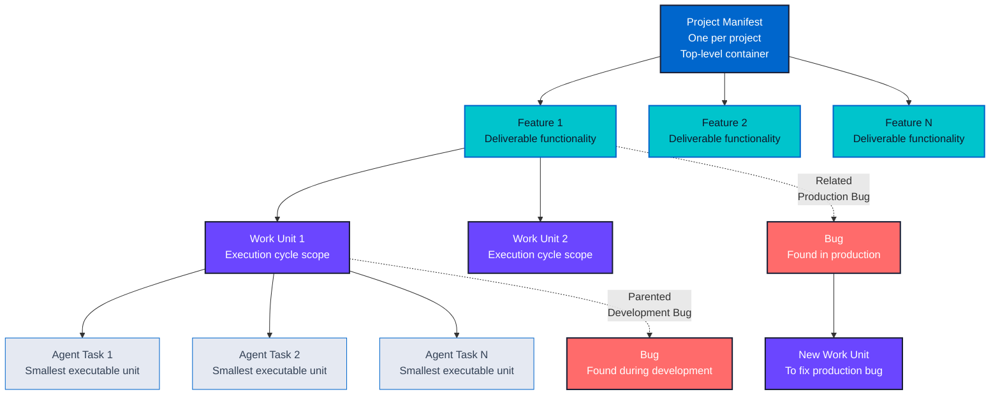

# Work Breakdown Structure (WBS)

## Overview

The Work Breakdown Structure (WBS) in RHYTHM Method provides a hierarchical organization of work that enables precise estimation, dependency tracking, and agent assignment. Unlike traditional WBS structures, RHYTHM Method's WBS is designed specifically for agentic development environments.

## WBS Hierarchy

RHYTHM Method uses a four-level hierarchy:



**Key Relationships:**

- **Solid arrows:** Parent-child relationships (Project Manifest → Feature → Work Unit → Agent Task)
- **Dashed arrows:** Bug relationships (parented to Work Unit or related to Feature)

### Level 1: Project Manifest

The top-level container for all work in a RHYTHM Method project.

**Characteristics:**

- **One per project**: Mandatory, single Project Manifest per project
- **Purpose**: Serves as the single source of truth for project requirements
- **Contains**: All **Features** in the project
- **Roles**:
  1. Top-level container for all Features
  2. Project information repository
  3. Decision log for architectural decisions and requirement changes

**Important:** Epics do **not** exist in RHYTHM Method. The Project Manifest completely replaces Epics from traditional project management methods (Scrum, Kanban, etc.).

**Key Differences from Traditional Epics:**

- **Traditional Epics**: Optional, can be multiple per project
- **Project Manifest**: Mandatory, exactly one per project
- **Traditional Epics**: Only serve as top-level containers
- **Project Manifest**: Includes decision tracking (similar to ADRs)
- **Project Manifest**: Serves as the project information repository

**Implementation Details:**

**Storage:**

- The Project Manifest is stored as a markdown file: `.baton/project.manifest.md`

- **Recommended**: Add exceptions to `.gitignore` to commit Project Manifest and Project Config:
  
  ```text
  .baton/
  !.baton/project.manifest.md
  !.baton/project.config.yml
  ```

- This ensures the Project Manifest is **committed to source control** and shared across the team

- Other `.baton/` files (agent contexts, notes, etc.) remain gitignored

**Relationship to Project Management Tools:**

The Project Manifest markdown file is the **single source of truth**. Features are tracked in project management tools (GitHub Issues, Azure DevOps, Jira, etc.), but the parent-child relationship is **conceptual**, not a direct link in the PM tool.

**Important:** To avoid sync issues, the Project Manifest should **NOT** be duplicated in PM tools (e.g., as a GitHub Issue). Instead:

- **Project Manifest** = Markdown file (`.baton/project.manifest.md`) - source of truth
- **Features** = Tracked in PM tools (e.g., GitHub Issues), conceptually parented to Project Manifest
- **Relationship** = Conceptual parent-child relationship, not a direct PM tool link

**Why Not Both Places?**

Creating a Project Manifest in both the markdown file AND a PM tool (e.g., GitHub Issue) would create:

- **Sync problems**: Two sources of truth that can diverge
- **Maintenance overhead**: Changes must be made in two places
- **Confusion**: Which one is authoritative?

**Best Practice:**

- Project Manifest = Markdown file only (single source of truth)
- Features in PM tools reference the Project Manifest conceptually
- The markdown file can link to Features in PM tools, but doesn't duplicate PM tool data

### Level 2: Feature

A required deliverable unit of functionality that provides business value.

**Characteristics:**

- **Purpose**: Deliverable functionality that provides business value
- **Deployment**: Can be deployed independently
- **Validation**: Has clear validation criteria
- **Contains**: One or more **Work Units**
- **Estimation**: Rolled up from Work Units using [token estimation](07-token-estimation.md)

**Feature Requirements:**

- Must provide business value
- Must be deployable independently
- Must have clear validation criteria
- Must contain at least one Work Unit

### Level 3: Work Unit

A specific piece of work that should be completed in a single **execution cycle** (target: up to 8 hours, some cycles may be less than 2 hours).

**Characteristics:**

- **Duration**: Up to 8 hours per execution cycle (guideline, not hard limit; cycles can be shorter)
- **Assignment**: Atomic unit of work assignment to specialized **agents**
- **Contains**: One or more **Agent Tasks**
- **Dependencies**: Can have dependencies on other Work Units
- **Estimation**: Rolled up from Agent Tasks using [token estimation](07-token-estimation.md)

**Work Unit Requirements:**

- Must belong to a Feature
- Should be completable in a single execution cycle (up to 8 hours target; cycles can be shorter)
- Must contain at least one Agent Task
- Must have clear completion criteria

**Duration Guidelines:**

- **Target**: Up to 8 hours per execution cycle (some cycles may be less than 2 hours)
- **If estimation exceeds 8 hours**: Split Work Unit into smaller units (preferred) or extend execution cycle with approval
- **See [Token Estimation](07-token-estimation.md) for detailed duration guidelines and splitting criteria**

**Execution Cycle Duration: Realistic Expectations**

**Understanding the Speed Difference:**
RHYTHM Method execution cycles (up to 8 hours) are fundamentally different from traditional 2-week sprints. This represents a 24-168x speed difference, which may seem unrealistic at first glance. However, this speed difference is achievable because:

**Why Execution Cycles Can Be So Fast:**

1. **Agent Speed**: Agents work at computational speeds, not human speeds
2. **Continuous Execution**: Agents work continuously without breaks, meetings, or context switching
3. **Parallel Execution**: Multiple agents work in parallel on different tasks
4. **Automated Processes**: Automated testing, deployment, and validation reduce overhead
5. **Focused Work**: Work Units are small, focused pieces of work

**Typical vs. Best Case:**

- **Typical Duration**: 2-6 hours for most Work Units
- **Best Case**: < 2 hours for simple, well-defined Work Units
- **Longer Cycles**: 6-8 hours for complex Work Units or when extending is approved
- **Factors Affecting Duration**: Complexity, dependencies, human availability for HITL checkpoints

**What Affects Execution Cycle Duration:**

**Factors That Speed Up Cycles:**

- **Well-Defined Work**: Clear specifications reduce ambiguity
- **No Dependencies**: Independent work can execute immediately
- **Established Patterns**: Similar to previous work, agents can work faster
- **Low HITL Overhead**: Fewer human approvals needed (High TEMPO)
- **Parallel Execution**: Multiple agents working simultaneously
- **Automated Quality Gates**: Fast validation and testing

**Factors That Slow Down Cycles:**

- **Complex Work**: Complex integrations, new domains, unclear requirements
- **Dependency Blockers**: Waiting for prerequisite work to complete
- **High HITL Overhead**: Many human approvals needed (Controlled TEMPO)
- **Human Unavailability**: Waiting for human responses at HITL checkpoints
- **Quality Gate Failures**: Fixing issues found during validation
- **Specification Changes**: Mid-cycle requirement changes

**When Cycles Take Longer:**

- **Complex Integrations**: Multi-service integrations may take 6-8 hours
- **New Domains**: Learning new technologies or domains adds time
- **High-Risk Work**: Controlled TEMPO with many HITL checkpoints
- **Dependency Delays**: Waiting for dependencies can extend cycles
- **Human Response Times**: Slow human responses at HITL checkpoints
- **Quality Issues**: Fixing quality gate failures extends cycles

**Realistic Expectations:**

- **Not Every Cycle is 2 Hours**: Some cycles take 6-8 hours, especially for complex work
- **Human Availability is the Bottleneck**: Agent speed is fast, but human availability for HITL checkpoints can slow cycles
- **Complexity Matters**: Simple work completes faster than complex work
- **Learning Curve**: Initial cycles may be slower as team learns RHYTHM Method
- **Continuous Improvement**: Cycles get faster as processes improve and patterns are established

**Comparison to Traditional Sprints:**

- **Traditional Sprint**: 2 weeks (80-160 hours of work across team)
- **RHYTHM Execution Cycle**: Up to 8 hours (single Work Unit)
- **Key Difference**: RHYTHM focuses on small, atomic Work Units, not entire sprint scope
- **Multiple Cycles**: Multiple execution cycles happen in the time of one traditional sprint
- **Continuous Flow**: Work flows continuously, not in discrete sprint boundaries

**Best Practices:**

1. **Start with Realistic Expectations**: Don't expect every cycle to be 2 hours
2. **Focus on Small Work Units**: Smaller Work Units complete faster
3. **Minimize Dependencies**: Independent work executes faster
4. **Optimize HITL Gates**: Configure appropriate TEMPO level for your needs
5. **Track Actual Durations**: Learn from actual cycle durations to improve estimation
6. **Continuous Improvement**: Use cycle reviews to identify and fix bottlenecks

### Level 4: Agent Task

The smallest unit of executable work in RHYTHM Method.

**Characteristics:**

- **Duration**: Typically 30 minutes to 2 hours
- **Assignment**: Completed by a single specialized **agent**
- **Scope**: Smallest executable unit
- **Estimation**: Direct [token estimation](07-token-estimation.md) at this level

**Agent Task Requirements:**

- Must belong to a Work Unit
- Must be completable by a single agent
- Must have clear completion criteria
- Must be properly specified before execution

## Special Work Items: Bugs

Bugs are handled differently in RHYTHM Method's WBS and require clear relationship definitions to prevent scope creep and ensure proper prioritization.

### Bug Relationships: Parented vs Related

**Understanding the Distinction:**

**Parented to Work Unit** (Development Bugs):

- **Definition**: Bugs found during active development work
- **Relationship Type**: Parent-child (bug belongs to the Work Unit)
- **When**: Bugs discovered while working on a Work Unit
- **Fix Location**: Fixed within the current execution cycle (as part of the Work Unit)
- **Scope**: Part of the Work Unit's scope, not separate work
- **Example**: Bug found while implementing authentication API → parented to that Work Unit → fixed before Work Unit completion

**Related to Feature** (Production Bugs):

- **Definition**: Bugs found in production or after Work Unit completion
- **Relationship Type**: Related (bug is associated with the Feature, not parented)
- **When**: Bugs discovered after deployment, during testing, or in production
- **Fix Location**: Requires a new Work Unit to fix (not part of original Work Unit)
- **Scope**: Separate work item requiring its own Work Unit
- **Example**: Bug found in production authentication → related to Authentication Feature → creates new Work Unit to fix

**Key Difference:**

- **Parented** = Bug is part of the Work Unit's scope (fix within current cycle)
- **Related** = Bug requires separate Work Unit to fix (new work item)

### Bug Lifecycle by Workflow Stage

**Feature Specification Stage:**

- **Bugs Found**: Specification issues, requirement gaps, design flaws
- **Handling**: Update specification (not tracked as bugs)
- **Relationship**: N/A (specification issues are fixed in specification, not tracked as bugs)

**Work Unit Review Stage:**

- **Bugs Found**: Specification clarity issues, feasibility problems
- **Handling**: Resolved during review (not tracked as bugs)
- **Relationship**: N/A (review feedback is addressed in specification updates)

**Work Unit Breakdown Stage:**

- **Bugs Found**: Task breakdown issues, missing dependencies
- **Handling**: Resolved during breakdown (not tracked as bugs)
- **Relationship**: N/A (breakdown issues are fixed in task breakdown)

**Task Execution Stage (Development):**

- **Bugs Found**: Code defects, implementation errors, test failures
- **Handling**: **Parented to Work Unit** - fixed within current execution cycle
- **Relationship**: Bug is parented to the Work Unit where it was discovered
- **Priority**: High - must be fixed before Work Unit completion
- **Example**: Unit test fails → bug parented to Work Unit → fixed before Work Unit marked complete

**Quality Assurance Stage:**

- **Bugs Found**: Integration issues, quality gate failures
- **Handling**:
  - If found before Work Unit completion → **Parented to Work Unit** (fix in current cycle)
  - If found after Work Unit completion → **Related to Feature** (requires new Work Unit)
- **Relationship**: Depends on timing (before/after Work Unit completion)

**Production/Post-Deployment:**

- **Bugs Found**: Production defects, user-reported issues
- **Handling**: **Related to Feature** - requires new Work Unit to fix
- **Relationship**: Bug is related to the Feature where it occurs
- **Priority**: Based on severity and business impact
- **Example**: Production bug in authentication → related to Authentication Feature → new Work Unit created to fix

### Bug Prioritization

**Parented Bugs (Development Bugs):**

- **Priority**: Highest - must be fixed before Work Unit completion
- **Impact**: Blocks Work Unit completion
- **Handling**: Fixed within current execution cycle
- **No separate prioritization needed** - part of Work Unit scope

**Related Bugs (Production Bugs):**

- **Priority**: Based on severity and business impact
- **Impact**: Affects production system or users
- **Handling**: Prioritized in work queue like other Work Units
- **Prioritization Rules**:
  - Critical bugs (system down, data loss) → Highest priority
  - High severity bugs (major functionality broken) → High priority
  - Medium severity bugs (minor functionality issues) → Normal priority
  - Low severity bugs (cosmetic, minor issues) → Lower priority
- **Dependency-Driven**: Follows dependency-driven prioritization (dependencies first, then business value)

### Bug Handling Workflow

**Development Bug Workflow (Parented):**

1. Bug discovered during Task Execution
2. Bug parented to current Work Unit
3. Bug fixed within current execution cycle
4. Work Unit cannot be marked complete until bug is fixed
5. Bug resolved as part of Work Unit completion

**Production Bug Workflow (Related):**

1. Bug discovered in production or after Work Unit completion
2. Bug related to affected Feature
3. Bug analyzed and prioritized
4. New Work Unit created to fix bug
5. Work Unit added to work queue (follows dependency-driven prioritization)
6. Bug fixed in new execution cycle
7. Bug resolved when Work Unit completes

### How RHYTHM Reduces Bug-Related Friction

Traditional project management (Scrum, Kanban, etc.) often creates friction around bugs through debates about:

- **"Is it even a bug?"** - Is this a defect or a feature request?
- **"What's the severity?"** - How bad is it? (Critical, High, Medium, Low)
- **"What's the priority?"** - When do we fix it? (Now, Later, Never?)

RHYTHM Method significantly reduces this friction through clear rules and automated prioritization:

#### 1. Eliminates "Is it a bug?" Debate for Development Bugs

**Traditional PM Problem:**

- Teams debate whether something is a bug or a feature request
- Ambiguous cases cause delays and confusion
- Scope creep from treating bugs as features or vice versa

**RHYTHM Solution:**

- **Development bugs (parented)**: If found during active work → It's a bug, parented to Work Unit, must fix. No debate.
- **Production bugs (related)**: If found after deployment → Related to Feature, requires new Work Unit. Clear distinction from feature requests.
- **Decision is automatic**: Based on when/where bug is found, not subjective judgment

#### 2. Eliminates Severity/Priority Debate for Development Bugs

**Traditional PM Problem:**

- Teams debate bug severity (Critical, High, Medium, Low)
- Teams debate priority (fix now vs. later)
- High-severity bugs may still be deprioritized
- Low-severity bugs may block releases

**RHYTHM Solution:**

- **Development bugs (parented)**: No severity or priority debate needed
  - **Priority**: Always highest (must fix before Work Unit completion)
  - **Severity**: Irrelevant (all parented bugs must be fixed)
  - **Impact**: Work Unit cannot be marked complete until all parented bugs are fixed
- **No meetings or debates**: The rule is automatic and enforced

#### 3. Reduces Priority Debate for Production Bugs

**Traditional PM Problem:**

- Teams debate priority: Should we fix this bug or work on new features?
- Business value vs. technical debt arguments
- Priority changes based on who complains loudest

**RHYTHM Solution:**

- **Production bugs (related)**: Follow dependency-driven prioritization
  - **Dependencies first**: Bugs that block other work are prioritized automatically
  - **Business value second**: Within same dependency level, severity determines order
  - **Automated prioritization**: Reduces subjective debates
- **Clear rules**: Critical bugs (system down) → Highest priority, but still follow dependency rules

#### 4. Prevents Scope Creep Through Clear Boundaries

**Traditional PM Problem:**

- Bugs used to add scope ("while we're fixing this, let's also...")
- Feature requests disguised as bugs
- Unclear boundaries between bugs and enhancements

**RHYTHM Solution:**

- **Parented bugs**: Part of Work Unit scope, fixed within current cycle
- **Related bugs**: Separate Work Unit, follows normal prioritization
- **New requests**: Always separate Work Unit, never disguised as bugs
- **Clear decision criteria**: Automatic classification based on when/where found

#### Summary: RHYTHM's Bug Friction Reduction

| Traditional PM Friction         | RHYTHM Solution                                                              |
| ------------------------------- | ---------------------------------------------------------------------------- |
| **"Is it a bug?" debate**       | Automatic: Found during work = parented bug, found after = related bug       |
| **Severity debate (dev bugs)**  | Eliminated: All parented bugs must be fixed, severity irrelevant             |
| **Priority debate (dev bugs)**  | Eliminated: Parented bugs always highest priority, block completion          |
| **Priority debate (prod bugs)** | Reduced: Dependency-driven prioritization removes subjective debates         |
| **Scope creep from bugs**       | Prevented: Clear boundaries between bugs (parented/related) and new requests |

**Key Insight:** RHYTHM eliminates most bug-related friction by making decisions automatic based on when/where bugs are found, rather than requiring human judgment and debate for every bug.

### Preventing Scope Creep

RHYTHM Method prevents scope creep by clearly distinguishing:

- **Bugs (Parented)**: Fix in current work (parented to Work Unit) - part of original scope
- **Bugs (Related)**: Create new Work Unit to fix (related to Feature) - new work item
- **New Requests**: Create new Work Unit (related to Feature) - new feature/functionality

**Decision Criteria:**

- **Is it a bug in current work?** → Parented to Work Unit (fix in current cycle)
- **Is it a bug in production/completed work?** → Related to Feature (new Work Unit)
- **Is it a new feature/request?** → Related to Feature (new Work Unit, different type)

## WBS Relationships

### Parent-Child Relationships

- **Project Manifest** → **Features**: One-to-many
- **Feature** → **Work Units**: One-to-many
- **Work Unit** → **Agent Tasks**: One-to-many

### Dependency Relationships

- **Work Units** can have dependencies on other Work Units
- **Agent Tasks** can have dependencies on other Agent Tasks
- Dependencies are tracked in the **dependency graph**

### Related Relationships

- **Bugs** can be related to Features (production bugs)
- **Work Units** can be related to other Work Units (non-dependency relationships)

## WBS in Practice

### Creating the WBS

1. **Start with Project Manifest**

   - Create the single Project Manifest for the project
   - Define project scope and objectives
   - Establish decision log

2. **Break Down into Features**

   - Identify deliverable units of functionality
   - Ensure Features provide business value
   - Define validation criteria for each Feature

3. **Break Down Features into Work Units**

   - Identify work that can be completed in a single execution cycle
   - Ensure Work Units are properly scoped
   - Identify dependencies between Work Units

4. **Break Down Work Units into Agent Tasks**

   - Identify smallest executable units
   - Assign to specialized agents
   - Estimate tokens for each task

### Maintaining the WBS

- **Living Structure**: WBS is continuously updated as work progresses
- **Dependency Tracking**: Dependencies are automatically tracked and updated
- **Estimation Updates**: Token estimates are refined as work progresses
- **Human Validation**: Major WBS changes require human approval

## Estimation and WBS

Token estimation flows from bottom to top:

1. **Agent Tasks**: Direct token estimation
2. **Work Units**: Roll-up from Agent Tasks
3. **Features**: Roll-up from Work Units
4. **Project Manifest**: Roll-up from Features

See [Token Estimation](07-token-estimation.md) for detailed information on token-based estimation.

---

## Dependency Relationships

Dependencies are tracked at the Work Unit and Agent Task levels:

- **Work Unit Dependencies**: Block entire Work Units
- **Agent Task Dependencies**: Block individual tasks within a Work Unit
- **Dependency Graph**: Automatically maintained and visualized

See [Dependency Management](08-dependency-management.md) for detailed information on dependency-driven prioritization.

## Summary

The RHYTHM Method WBS provides a hierarchical structure (Project Manifest → Feature → Work Unit → Agent Task) that enables precise estimation, dependency tracking, and agent assignment. The WBS is designed specifically for agentic development environments, with clear boundaries, validation criteria, and relationship types that support fast TEMPO execution while maintaining RHYTHM control.

---

## Navigation

**Previous:** [State Management](05-state-management.md) - State transitions
**Next:** [Token Estimation](07-token-estimation.md) - Token-based estimation methodology

---

## Change History

| Version | Date       | Author              | Description                                                                                                                                                            |
| ------- | ---------- | ------------------- | ---------------------------------------------------------------------------------------------------------------------------------------------------------------------- |
| 1.0.0   | 2025-11-24 | Initial             | Initial WBS documentation                                                                                                                                              |
| 1.1.0   | 2025-11-26 | rhythm-expert-agent | Clarified Work Unit duration: 2-8 hours is a guideline (not hard limit), added guidance for when estimation exceeds 8 hours                                            |
| 1.2.0   | 2025-11-26 | rhythm-expert-agent | Expanded bug handling: clarified parented vs related distinction, added complete bug lifecycle by workflow stage, bug prioritization rules, and bug handling workflows |
| 1.3.0   | 2025-12-14 | Agent               | Migrated to numbered format in RHYTHM-Method documentation repository structure                                                                                        |
