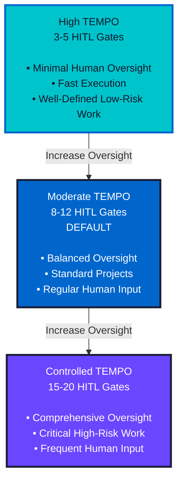

# TEMPO: The Speed of Agentic Development

## What is TEMPO?

**TEMPO** is a concept within the RHYTHM Method that describes the **speed/pace at which agents operate**. Just as tempo in music determines the speed of a piece, TEMPO in RHYTHM Method describes how fast agents work.

> **Note:** TEMPO uses a music metaphor to explain the relationship between speed and control in RHYTHM Method.

### The Music Metaphor

In music:

- **Tempo** = The speed of the music (fast, slow, moderate)
- **Rhythm** = The pattern and flow that creates structure and control

In RHYTHM Method:

- **TEMPO** = The speed at which agents operate (fast computational speeds)
- **RHYTHM** = The control, flow, and coordination that ensures quality and alignment

**Key Insight:** Agents work at a fast tempo, but RHYTHM ensures control, flow, and Human-in-the-Loop (HITL) integration.

## Understanding TEMPO

### Agents Operate at Fast TEMPO

Agents work at computational speeds that are fundamentally different from human teams:

- **Hours, not weeks**: Agents can complete work in hours that would take human teams weeks
- **Continuous execution**: Agents don't need breaks, meetings, or context switching delays
- **Parallel processing**: Multiple agents can work simultaneously on different tasks
- **Instant analysis**: Agents can analyze dependencies, estimate work, and replan instantly

### TEMPO Characteristics

**Fast Execution:**

- Work that takes human teams 2 weeks can be completed by agents in up to 8 hours (some cycles may be less than 2 hours)
- Continuous execution cycles instead of discrete sprints
- Real-time status updates and validation

**Precision and Speed:**

- Token-based estimation (precise) instead of abstract story points
- Automated dependency analysis and prioritization
- Instant replanning when priorities or dependencies change

**Automated Coordination:**

- Agent-to-agent communication and coordination
- Automated quality gates and validation
- Real-time dependency resolution

## TEMPO vs. Human Speed

### Traditional Human Teams

| Aspect                  | Human Teams                  | Agent Teams (TEMPO)                            |
| ----------------------- | ---------------------------- | ---------------------------------------------- |
| **Time Scale**          | Weeks, months                | Hours, days                                    |
| **Planning**            | Sprint planning (days)       | Continuous planning (minutes)                  |
| **Execution**           | 2-week sprints               | Up to 8 hour execution cycles (some < 2 hours) |
| **Replanning**          | Sprint retrospective (weeks) | Instant replanning (minutes)                   |
| **Dependency Analysis** | Manual, risk-based           | Automated, precise                             |
| **Estimation**          | Story points (abstract)      | Token estimation (precise)                     |

### Why TEMPO Matters

**Speed is inherent with agents**—they operate at fast computational speeds by nature. However, speed alone isn't enough. That's where **RHYTHM** comes in.

**Business Value:** Fast TEMPO enables rapid delivery cycles that transform how projects are executed. Work that traditionally takes weeks can be completed in hours, dramatically reducing time-to-market and enabling faster iteration. This speed advantage allows teams to respond quickly to changing requirements, test ideas rapidly, and deliver value continuously. However, TEMPO without RHYTHM (control) leads to chaos. RHYTHM ensures that fast execution maintains quality, alignment, and strategic direction—delivering speed with confidence.

## TEMPO + RHYTHM = Controlled Speed

### The Problem with Pure Speed

If agents operate at fast TEMPO without RHYTHM (control, flow, coordination), you get:

- **Chaos**: Fast but uncoordinated work
- **Quality issues**: Speed without validation
- **Dependency conflicts**: Fast execution without proper dependency management
- **Human exclusion**: Too fast for humans to provide strategic input

### The Solution: RHYTHM Ensures Control

RHYTHM Method ensures that fast TEMPO is controlled and coordinated:

- **Flow**: Dependency-driven prioritization ensures work happens in the right order
- **Control**: Human-in-the-Loop checkpoints at critical decision points
- **Coordination**: Multi-agent collaboration with structured interfaces
- **Quality**: Automated quality gates with configurable HITL
- **Alignment**: Strategic human input at key decision points

## TEMPO in Practice

### Execution Cycles

Instead of 2-week sprints, RHYTHM Method uses **execution cycles** (up to 8 hours, some cycles may be less than 2 hours):

- **Fast TEMPO**: Work is completed in hours, not weeks
- **RHYTHM Control**: Each cycle has clear dependencies, validation, and HITL checkpoints
- **Continuous Flow**: Cycles happen continuously, not in discrete sprints

### Continuous Planning

Instead of sprint planning meetings, RHYTHM Method uses **continuous planning**:

- **Fast TEMPO**: Plans are updated in real-time as work progresses
- **RHYTHM Control**: Plans are validated and approved by humans at key decision points
- **Adaptive**: Plans adapt instantly when priorities or dependencies change

### Real-Time Coordination

Instead of daily standups, RHYTHM Method uses **real-time coordination**:

- **Fast TEMPO**: Agents coordinate instantly through structured interfaces
- **RHYTHM Control**: Coordination is visible to humans through real-time dashboards
- **Strategic Input**: Humans provide strategic guidance at critical coordination points

## Managing TEMPO

### TEMPO Level Definitions

RHYTHM Method provides three TEMPO levels, each with different HITL gate configurations:

**High TEMPO:**

- **Speed**: Maximum agent autonomy, minimal human intervention
- **HITL Gates**: Only critical decision points
- **Use Case**: Well-defined, low-risk work where specifications are clear and stable
- **User Involvement**: Minimal - primarily at project start and major milestones
- **Risk Level**: Low to moderate risk projects
- **Team Experience**: Experienced teams with established patterns
- **Gate Count**: ~3-5 gates per feature cycle

**Moderate TEMPO (Default):**

- **Speed**: Balanced agent autonomy with strategic human input
- **HITL Gates**: Key decision points and validation checkpoints
- **Use Case**: Standard projects with some complexity, evolving requirements
- **User Involvement**: Regular - at planning checkpoints and quality gates
- **Risk Level**: Moderate risk projects
- **Team Experience**: Mixed experience levels
- **Gate Count**: ~8-12 gates per feature cycle

**Controlled TEMPO:**

- **Speed**: More human oversight, slower agent autonomy
- **HITL Gates**: Comprehensive checkpoints at multiple stages
- **Use Case**: Critical, high-risk work, new domains, complex integrations
- **User Involvement**: Frequent - at most planning and execution checkpoints
- **Risk Level**: High risk projects
- **Team Experience**: New teams, new domains, or critical systems
- **Gate Count**: ~15-20 gates per feature cycle

### Available HITL Gates

RHYTHM Method provides the following HITL gates/checkpoints:

**Planning & Preparation Phase Gates:**

- Project Initialization: Project Manifest validation, Project Configuration approval, Project Boundaries review
- Feature Specification: Feature specification approval, Critical dependencies review
- Work Unit Creation: Work unit breakdown validation, Work unit priorities approval
- Work Unit Review: Agent feedback review, Review acceptance/sign-off
- Work Unit Breakdown: Task breakdown validation, Task assignments approval, Task readiness approval

**Execution Phase Gates:**

- Work Queue: High-priority task execution approval
- Task Execution: Execution cycle scope approval
- Continuous Planning: Major plan changes review, Priority adjustments approval
- Dependency Management: Critical dependencies review, Dependency override approval
- Quality Assurance: Quality gate results review, Deployment approval
- Cycle Review: Cycle analysis review

### HITL Gate Configurations by TEMPO Level

#### High TEMPO Configuration

**Required Gates (Minimal):**

- Project Initialization: Project Manifest validation
- Feature Specification: Feature specification approval
- Work Unit Breakdown: Task readiness approval (optional)
- Quality Assurance: Deployment approval (for production)

**Optional Gates:**

- Work Unit Review: Agent feedback review (as needed)
- Quality Assurance: Quality gate results review (only on failures)

**Skipped Gates (Auto-Approved):**

- Work Unit Creation: Work unit breakdown validation
- Work Unit Breakdown: Task breakdown validation
- Work Queue: High-priority task execution approval
- Task Execution: Execution cycle scope approval
- Continuous Planning: Major plan changes review (notification only)
- Dependency Management: Critical dependencies review (auto-resolved)

#### Moderate TEMPO Configuration (Default)

**Required Gates:**

- Project Initialization: All gates (Project Manifest, Configuration, Boundaries)
- Feature Specification: Feature specification approval + Critical dependencies review
- Work Unit Review: Review acceptance/sign-off
- Work Unit Breakdown: Task readiness approval
- Quality Assurance: Quality gate results review + Deployment approval

**Optional Gates:**

- Work Unit Creation: Work unit priorities approval (for high-value work)
- Work Queue: High-priority task execution approval (for critical path)
- Task Execution: Execution cycle scope approval (for large cycles)
- Continuous Planning: Major plan changes review
- Dependency Management: Critical dependencies review

**Skipped Gates (Auto-Approved):**

- Work Unit Breakdown: Task breakdown validation (auto-approved if reviewed)
- Continuous Planning: Priority adjustments approval (notification only)

#### Controlled TEMPO Configuration

**Required Gates (Comprehensive):**

- Project Initialization: All gates
- Feature Specification: All gates (Specification approval + Critical dependencies)
- Work Unit Creation: Work unit breakdown validation + Priorities approval
- Work Unit Review: Agent feedback review + Review acceptance/sign-off
- Work Unit Breakdown: Task breakdown validation + Task assignments approval + Task readiness approval
- Work Queue: High-priority task execution approval
- Task Execution: Execution cycle scope approval
- Continuous Planning: Major plan changes review + Priority adjustments approval
- Dependency Management: Critical dependencies review + Dependency override approval
- Quality Assurance: Quality gate results review + Deployment approval
- Cycle Review: Cycle analysis review

**Note:** In Controlled TEMPO, all gates are required - there are no optional or skipped gates.

### TEMPO Level Comparison

The following diagram illustrates the relationship between TEMPO levels, HITL gates, and use cases:

**Key Characteristics:**

- **High TEMPO:** Maximum speed, minimal oversight, experienced teams
- **Moderate TEMPO:** Balanced approach, standard projects, recommended default
- **Controlled TEMPO:** Maximum oversight, critical work, new teams/domains

### Choosing a TEMPO Level

**Decision Matrix:**

| Factor                      | High TEMPO           | Moderate TEMPO      | Controlled TEMPO   |
| --------------------------- | -------------------- | ------------------- | ------------------ |
| **Project Risk**            | Low                  | Moderate            | High               |
| **Work Complexity**         | Simple, well-defined | Moderate complexity | Complex, uncertain |
| **User Availability**       | Limited              | Regular             | Frequent           |
| **Team Experience**         | Experienced          | Mixed               | New team/domain    |
| **Requirements Stability**  | Stable               | Some changes        | Evolving           |
| **Domain Familiarity**      | High                 | Moderate            | Low                |
| **Integration Complexity**  | Simple               | Moderate            | Complex            |
| **Business Criticality**    | Low                  | Moderate            | High               |
| **Regulatory Requirements** | None/Minimal         | Some                | Strict             |

**Selection Guidelines:**

1. **Start with Moderate TEMPO** (default) unless you have specific reasons to change

2. **Choose High TEMPO** when:
   
   - Work is well-defined and low-risk
   - User has limited availability
   - Team is experienced with the domain
   - Requirements are stable
   - Similar work has been done before

3. **Choose Controlled TEMPO** when:
   
   - Work is critical or high-risk
   - User wants frequent oversight
   - Team is new to domain or technology
   - Requirements are evolving
   - Regulatory or compliance requirements exist
   - Complex integrations or dependencies

4. **Adjust TEMPO** during project:
   
   - Increase TEMPO (reduce gates) as team gains experience
   - Decrease TEMPO (add gates) for critical phases
   - Use different TEMPO for different features/work units

### Configuring HITL Gates

**Key Principle:** HITL gates are fully configurable by the User based on:

- Project characteristics and requirements
- Desired level of involvement
- Risk tolerance and business needs
- Team experience and domain familiarity

**Configuration Options:**

1. **Per-Project Configuration:**
   
   - Set default TEMPO level for entire project
   - Override for specific features/work units

2. **Per-Gate Configuration:**
   
   - Enable/disable specific gates regardless of TEMPO level
   - Set gates as required, optional, or skipped

3. **Dynamic Configuration:**
   
   - Adjust gates based on work complexity
   - Add gates for critical work
   - Remove gates for routine work

4. **User Availability-Based:**
   
   - Configure gates based on user availability schedule
   - Batch approvals for efficiency
   - Async approval workflows

**Note:** TEMPO configuration must be user-driven and flexible. The configurations above are starting points—customize based on your project needs and desired involvement level.

### Human Availability and Response Times

**The Challenge:**
HITL gates require human availability and response. If humans are unavailable or don't respond, work may stall. RHYTHM Method includes mechanisms to handle human unavailability while maintaining appropriate control.

**Response Time Expectations:**

**Immediate Response (Emergency):**

- **Scope**: Critical failures, system instability, production issues
- **Expected Response**: < 15 minutes
- **Escalation**: If no response, escalate to backup approver or emergency procedures

**High Priority Response:**

- **Scope**: High-priority work, critical path blockers, major decisions
- **Expected Response**: < 2 hours
- **Escalation**: If no response, auto-approve low-risk items, queue high-risk items

**Normal Priority Response:**

- **Scope**: Routine approvals, non-critical decisions
- **Expected Response**: < 8 hours (within business day)
- **Escalation**: If no response, auto-approve after timeout (with notification)

**Low Priority Response:**

- **Scope**: Optional reviews, informational notifications
- **Expected Response**: < 24 hours
- **Escalation**: No escalation needed, work proceeds

**Handling Human Unavailability:**

**1. Timeout Mechanisms:**

**Auto-Approval After Timeout:**

- **Low-Risk Work**: Auto-approve after timeout (e.g., 8 hours for normal priority)
- **Conditions**: Work is low-risk, well-defined, agent confidence is high
- **Notification**: Human notified of auto-approval
- **Override**: Human can override auto-approval if needed

**Queue High-Risk Work:**

- **High-Risk Work**: Queue work if human unavailable (no auto-approval)
- **Conditions**: Work is high-risk, ambiguous, or requires human judgment
- **Notification**: Human notified of queued work
- **Escalation**: Escalate to backup approver if timeout exceeded

**2. Default Behaviors:**

**When Human Unavailable:**

- **Low-Risk Work**: Auto-approve after timeout (with notification)
- **High-Risk Work**: Queue work, wait for human response
- **Critical Work**: Escalate to backup approver or emergency procedures
- **Routine Work**: Proceed with agent confidence-based approval

**3. Escalation Procedures:**

**Escalation Triggers:**

- Human doesn't respond within expected time window
- Critical work blocked waiting for approval
- Multiple approvals queued for extended period

**Escalation Levels:**

- **Level 1**: Notify human again (reminder)
- **Level 2**: Escalate to backup approver (if configured)
- **Level 3**: Escalate to project lead or manager
- **Level 4**: Emergency escalation (for critical issues)

**4. Timezone Handling:**

**Timezone Considerations:**

- **Availability Windows**: Configure availability windows based on user timezone
- **Batch Approvals**: Batch approvals for users in different timezones
- **Async Workflows**: Support async approval workflows across timezones
- **Notification Timing**: Send notifications during user's business hours

**5. Availability-Based Configuration:**

**Configure Gates Based on Availability:**

- **High Availability**: More HITL gates, faster response expected
- **Limited Availability**: Fewer HITL gates, longer response times acceptable
- **Scheduled Availability**: Configure gates around user's availability schedule
- **Batch Processing**: Batch multiple approvals for efficiency

**Best Practices:**

1. **Set Clear Expectations**: Define expected response times for each gate type
2. **Configure Timeouts**: Set appropriate timeouts based on work priority
3. **Enable Auto-Approval**: Enable auto-approval for low-risk work
4. **Set Up Escalation**: Configure backup approvers for critical work
5. **Monitor Response Times**: Track response times and adjust expectations
6. **Batch Approvals**: Use batch approvals to reduce overhead
7. **Timezone Awareness**: Configure availability windows based on timezones

## TEMPO and Human Collaboration

### Fast TEMPO Doesn't Mean Excluding Humans

RHYTHM Method ensures that fast TEMPO includes humans strategically:

- **Strategic Input**: Humans provide business context and strategic guidance
- **Critical Decisions**: Humans approve major decisions and priorities
- **Validation**: Humans validate specifications and deliverables
- **Oversight**: Humans maintain visibility and control through real-time dashboards

### Human-AI Partnership

TEMPO enables a true human-AI partnership:

- **Agents handle execution**: Fast, precise, automated work
- **Humans handle strategy**: Business context, ethical considerations, creative problem-solving
- **RHYTHM ensures balance**: Control, flow, and coordination between agents and humans

### HITL vs Automation Balance

**The Challenge:**
RHYTHM Method emphasizes both fast TEMPO (automation) and human control (HITL). Finding the right balance is critical—too much automation risks losing control, while too much HITL slows TEMPO unnecessarily.

**Decision Framework: When to Use HITL vs Automation**

**Use Automation (Reduce HITL) When:**

- **Well-Defined Work**: Clear specifications, established patterns, routine work
- **Low Risk**: Work has low business impact, reversible changes, non-critical systems
- **High Confidence**: Agent confidence is high, similar work completed successfully
- **Fast Feedback**: Automated quality gates provide sufficient validation
- **Limited Human Availability**: Humans have limited time for approvals

**Use HITL (Increase Human Control) When:**

- **Strategic Decisions**: Business-critical decisions, priority changes, scope decisions
- **High Risk**: Critical systems, production deployments, data changes, security-sensitive work
- **Ambiguous Requirements**: Unclear specifications, new domains, complex integrations
- **Low Confidence**: Agent uncertainty, new patterns, untested approaches
- **Ethical Considerations**: Decisions requiring human judgment, compliance, regulatory requirements

**Decision Matrix:**

| Factor              | Use Automation        | Use HITL                    |
| ------------------- | --------------------- | --------------------------- |
| **Work Type**       | Routine, well-defined | Strategic, ambiguous        |
| **Risk Level**      | Low risk              | High risk                   |
| **Confidence**      | High agent confidence | Low agent confidence        |
| **Business Impact** | Low impact            | High impact                 |
| **Reversibility**   | Easily reversible     | Difficult to reverse        |
| **Pattern**         | Established pattern   | New pattern                 |
| **Domain**          | Familiar domain       | New domain                  |
| **Compliance**      | No compliance needs   | Regulatory/compliance needs |

**HITL Gate Configuration by Decision Type:**

**Always Require HITL:**

- Feature Specification approval (strategic decision)
- Production deployment approval (high risk)
- Dependency overrides (strategic decision)
- Scope changes (strategic decision)
- High-value work approval (business impact)

**Automate (No HITL Required):**

- Routine Work Unit creation (well-defined work)
- Task breakdown for established patterns (high confidence)
- Low-risk quality gate passes (automated validation sufficient)
- Dependency detection (automated analysis)
- Queue reordering (automated prioritization)

**Conditional HITL (Based on Risk/Confidence):**

- Work Unit Review (HITL for high-risk, auto-approve for low-risk)
- Quality gate failures (HITL for critical failures, auto-retry for transient)
- Task execution approval (HITL for complex work, auto-approve for routine)
- Capacity planning changes (HITL for major changes, notification for minor)

**Guidelines for Reducing HITL Overhead:**

1. **Start with Moderate TEMPO**: Begin with balanced HITL, adjust based on experience
2. **Use Auto-Approval Criteria**: Define clear criteria for auto-approval
3. **Batch Approvals**: Review and approve multiple items in batches
4. **Trust Automated Quality Gates**: Use automated gates for validation where appropriate
5. **Reduce Redundant Gates**: Don't require approval at every step
6. **Use Confidence Scores**: Auto-approve when agent confidence is high
7. **Monitor and Adjust**: Track approval patterns and adjust gates accordingly

**Examples of Appropriate HITL Usage:**

**Example 1: Feature Specification**

- **HITL Required**: Yes (strategic decision)
- **Why**: Business value, scope, and priorities require human judgment
- **Automation**: Agents can draft specifications, but humans approve

**Example 2: Routine Work Unit Creation**

- **HITL Required**: Conditional (auto-approve for routine work)
- **Why**: Routine work follows established patterns, low risk
- **Automation**: Auto-approve if matches established patterns, HITL for new patterns

**Example 3: Quality Gate Failures**

- **HITL Required**: Conditional (auto-retry for transient, HITL for persistent)
- **Why**: Transient failures can auto-retry, persistent failures need human analysis
- **Automation**: Auto-retry transient failures, HITL for persistent failures

**Example 4: Production Deployment**

- **HITL Required**: Yes (high risk)
- **Why**: Production changes have high impact, require human approval
- **Automation**: Automated deployment after human approval

**Balancing Act:**

- **Too Much Automation**: Risk losing control, quality issues, misalignment
- **Too Much HITL**: Slow TEMPO, approval bottlenecks, reduced agent efficiency
- **Right Balance**: Strategic HITL at critical points, automation for routine work

**Best Practices:**

1. **Start Conservative**: Begin with more HITL, reduce as confidence grows
2. **Monitor Effectiveness**: Track whether HITL gates catch issues
3. **Adjust Based on Results**: Increase automation for proven patterns
4. **Maintain Strategic Control**: Always require HITL for strategic decisions
5. **Use TEMPO Levels**: TEMPO levels provide starting points for HITL configuration

## Summary

**TEMPO** describes the fast speed at which agents operate (hours instead of weeks), while **RHYTHM** ensures that fast TEMPO is controlled and coordinated through dependency-driven prioritization, Human-in-the-Loop checkpoints, multi-agent coordination, and strategic human input. Together, **TEMPO + RHYTHM** enable agents to work at their full potential while ensuring humans maintain strategic control and oversight.

---

## Navigation

**Previous:** [Dependency Management](08-dependency-management.md) - Dependency-driven prioritization
**Next:** [Project Setup](10-project-setup.md) - Project configuration and setup

---

## Change History

| Version | Date       | Author              | Description                                                                                               |
| ------- | ---------- | ------------------- | --------------------------------------------------------------------------------------------------------- |
| 1.0.0   | 2025-11-24 | Initial             | Initial TEMPO concept docs                                                                                |
| 1.1.0   | 2025-11-26 | rhythm-expert-agent | Added TEMPO level definitions, HITL gate configurations, decision matrix, and user configuration guidance |
| 1.2.0   | 2025-12-14 | Agent               | Migrated to numbered format in RHYTHM-Method documentation repository structure                           |
