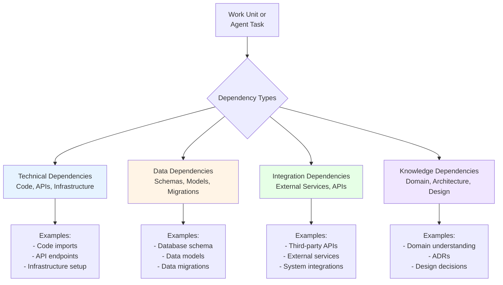

# Dependency Management

**Version:** 1.1.0  
**Last Updated:** 2025-11-26  
**Status:** Updated with Detailed Dependency Detection

## Overview

Dependency management in RHYTHM Method uses **dependency-driven prioritization** to ensure work happens in the correct order. Dependencies are automatically detected, tracked, and resolved, with human oversight at critical decision points.

**Business Value:** Dependency-driven prioritization eliminates the common problem of blocked work and wasted effort. By ensuring prerequisites are completed before dependent work begins, teams avoid starting work that can't be finished, reduce context switching, and maintain continuous flow. Automated dependency detection catches dependencies that humans might miss, preventing costly rework and delays. This systematic approach ensures work happens in the optimal order, maximizing efficiency and minimizing blockers that slow down delivery.

## What is Dependency-Driven Prioritization?

Dependency-driven prioritization is a mandatory prioritization rule in RHYTHM Method where:

1. **Dependencies First**: Work is ordered by [dependency graph](03-dictionary.md#dependency-graph) first
2. **Business Value Second**: Within the same dependency level, work is ordered by business value
3. **Mandatory Rule**: Dependencies must be resolved before dependent work can begin

## Types of Dependencies

### Technical Dependencies

Dependencies on code, APIs, or infrastructure:

- **Code Dependencies**: Requires specific code to be written first
- **API Dependencies**: Requires API endpoints or services to be available
- **Infrastructure Dependencies**: Requires infrastructure setup or configuration

### Data Dependencies

Dependencies on data structures or database schemas:

- **Schema Dependencies**: Requires database schema changes
- **Data Model Dependencies**: Requires data models to be defined
- **Migration Dependencies**: Requires data migrations to be completed

### Integration Dependencies

Dependencies on external services or systems:

- **External Service Dependencies**: Requires external services to be integrated
- **Third-Party API Dependencies**: Requires third-party APIs to be available
- **System Integration Dependencies**: Requires system integrations to be completed

### Knowledge Dependencies

Dependencies on domain understanding or decisions:

- **Domain Knowledge Dependencies**: Requires domain understanding to be established
- **Architecture Decision Dependencies**: Requires architectural decisions to be made
- **Design Decision Dependencies**: Requires design decisions to be finalized

### Dependency Types Overview

The following diagram illustrates the four main types of dependencies in RHYTHM Method:

**Detection Methods:**
- **Technical & Data:** Automated code analysis, specification analysis
- **Integration:** API contract analysis, service dependency analysis
- **Knowledge:** Specification analysis, decision log analysis (may require manual identification)

## Dependency Detection

### Automated Detection

Agents automatically detect dependencies through multiple analysis methods. Each method has specific techniques and handles different types of dependencies:

#### 1. Code Analysis

**Method**: Agents analyze code structure, imports, and references to identify technical dependencies.

**Detection Techniques:**

- **Import/Require Analysis**: Parse import statements, require() calls, and module dependencies
  - Example: `import { UserService } from './services/user-service'` → Dependency on UserService module
  - Example: `require('database/models')` → Dependency on database models
- **Function/Method Calls**: Analyze function calls to identify dependencies on other modules/services
  - Example: `authService.validateToken()` → Dependency on authService
  - Example: `database.query()` → Dependency on database module
- **Type/Interface References**: Analyze type definitions and interface implementations
  - Example: `class UserController implements IUserController` → Dependency on IUserController interface
- **File/Module References**: Track file and module references across codebase
  - Example: Relative imports, absolute imports, module paths

**Tools/Methods:**

- Static code analysis (AST parsing)
- Dependency graph tools (e.g., dependency-cruiser, madge)
- Language-specific analyzers (TypeScript compiler, Python AST, etc.)
- Import/export analysis

**Examples of Detected Dependencies:**

- Work Unit B imports code from Work Unit A → Technical dependency: B depends on A
- Work Unit C calls API endpoint defined in Work Unit D → API dependency: C depends on D
- Work Unit E uses database schema from Work Unit F → Data dependency: E depends on F

#### 2. Specification Analysis

**Method**: Agents analyze specification documents to identify dependencies mentioned in requirements.

**Detection Patterns:**

- **Explicit Mentions**: Specifications that explicitly reference other Features or Work Units
  - Pattern: "Requires Feature X to be completed first"
  - Pattern: "Depends on Work Unit Y"
  - Pattern: "Uses API from Feature Z"
- **Implicit References**: Specifications that imply dependencies through requirements
  - Pattern: "User must be authenticated" → Dependency on authentication Feature
  - Pattern: "Data must be stored in user database" → Dependency on database schema Work Unit
  - Pattern: "Integrates with payment service" → Dependency on payment integration Work Unit
- **Validation Criteria**: Dependencies implied by test/validation requirements
  - Pattern: "Must work with existing user system" → Dependency on user system Feature
- **Technical Constraints**: Dependencies from technical requirements
  - Pattern: "Requires API version 2.0" → Dependency on API version Work Unit

**Analysis Process:**

1. Parse specification documents (YAML/JSON/Markdown)
2. Extract feature/work unit references
3. Identify requirement patterns that imply dependencies
4. Match requirements to existing Features/Work Units
5. Flag ambiguous dependencies for human review

**Examples of Detected Dependencies:**

- Feature Specification: "User profile page requires authentication system" → Feature dependency detected
- Work Unit Specification: "API endpoint needs user database schema" → Data dependency detected

#### 3. API Analysis

**Method**: Agents analyze API contracts, interfaces, and service definitions to identify integration dependencies.

**Detection Techniques:**

- **API Contract Analysis**: Parse OpenAPI/Swagger specs, GraphQL schemas, gRPC definitions
  - Example: API endpoint definition references another service → Integration dependency
- **Interface Definitions**: Analyze interface/contract definitions
  - Example: Service interface requires another service → Service dependency
- **API Calls in Code**: Detect API calls to other services/endpoints
  - Example: `fetch('/api/users')` → Dependency on users API
- **Service Dependencies**: Analyze microservice dependencies
  - Example: Service A calls Service B → Service dependency

**Examples of Detected Dependencies:**

- Work Unit defines API that calls external payment service → Integration dependency
- Feature requires authentication API to be available → API dependency

#### 4. Pattern Recognition

**Method**: Agents use pattern matching to identify common dependency patterns from historical data.

**Common Patterns:**

- **Sequential Patterns**: Work Unit A always followed by Work Unit B
- **Prerequisite Patterns**: Certain types of work always require specific prerequisites
- **Domain Patterns**: Domain-specific dependency patterns (e.g., authentication → authorization → user management)
- **Architectural Patterns**: Dependencies based on architectural decisions

**Pattern Learning:**

- Agents learn from historical dependency data
- Identify recurring dependency patterns
- Apply patterns to new work items
- Refine patterns based on actual execution

#### 5. Knowledge Dependency Detection

**Method**: Knowledge dependencies are detected through specification and decision log analysis.

**Detection Techniques:**

- **Architecture Decision References**: Specifications that reference ADRs or architectural decisions
  - Pattern: "As per ADR-001, we use microservices architecture" → Knowledge dependency on ADR-001
- **Domain Knowledge Requirements**: Specifications requiring domain understanding
  - Pattern: "Requires understanding of payment processing domain" → Knowledge dependency
- **Design Decision Dependencies**: References to design decisions not yet made
  - Pattern: "Design pattern to be determined" → Knowledge dependency on design decision
- **Project Manifest Analysis**: Dependencies on project-level decisions
  - Pattern: References to Project Manifest decisions → Knowledge dependency

**Limitations:**

- Knowledge dependencies are harder to detect automatically
- Often require human identification or explicit specification
- May be flagged during Work Unit Review rather than automated detection

### Manual Review Process

**Purpose**: Validate automated detection and identify dependencies that automation misses.

**Review Triggers:**

- New dependencies detected automatically (human validation)
- Ambiguous dependencies (multiple possible interpretations)
- High-risk dependencies (critical path, complex integrations)
- Knowledge dependencies (require human judgment)

**Review Process:**

1. **Automated Detection Report**: Agents generate dependency detection report
2. **Human Review**: User reviews detected dependencies
3. **Validation**: Confirm or reject detected dependencies
4. **Manual Addition**: Add dependencies that automation missed
5. **False Positive Removal**: Remove incorrectly detected dependencies
6. **Dependency Graph Update**: Update dependency graph with validated dependencies

### Handling False Positives and Negatives

**False Positives (Incorrectly Detected Dependencies):**

**Common Causes:**

- Code imports that are not actual dependencies (e.g., utility imports)
- Specification mentions that are not dependencies (e.g., examples, comparisons)
- Pattern matching that incorrectly applies historical patterns

**Handling:**

- Human review flags false positives
- Remove from dependency graph
- Update detection patterns to reduce future false positives
- Document false positive patterns for learning

**False Negatives (Missed Dependencies):**

**Common Causes:**

- Hidden dependencies not visible in code/specifications
- Strategic dependencies requiring business context
- External dependencies on factors outside codebase
- Knowledge dependencies requiring domain expertise

**Handling:**

- Manual dependency identification during Work Unit Review
- Human identification of strategic dependencies
- Regular dependency audits
- Update detection patterns based on missed dependencies

**Improvement Process:**

1. Track false positives and negatives
2. Analyze patterns in detection errors
3. Refine detection algorithms
4. Update pattern recognition models
5. Improve specification analysis patterns

### Edge Cases and Special Situations

**Circular Dependencies:**

- Detection: Agents identify circular dependency chains
- Handling: Flag for human review and resolution
- Resolution: Redesign work to break circular dependencies

**Optional Dependencies:**

- Detection: Dependencies marked as optional in specifications
- Handling: Track as optional dependencies (don't block execution)
- Usage: Inform prioritization but don't enforce blocking

**Conditional Dependencies:**

- Detection: Dependencies that only apply under certain conditions
- Handling: Track conditions and apply dependencies when conditions met
- Example: "Depends on Feature X if using payment method Y"

**Transitive Dependencies:**

- Detection: Dependencies through intermediate work items
- Handling: Automatically track transitive dependencies
- Example: A depends on B, B depends on C → A transitively depends on C

### Manual Identification

Humans can manually identify dependencies that automation misses:

- **Strategic Dependencies**: Business or strategic dependencies requiring human judgment
- **Hidden Dependencies**: Dependencies not visible in code or specifications
- **External Dependencies**: Dependencies on external factors (vendors, regulations, timelines)
- **Knowledge Dependencies**: Domain knowledge or architectural decisions
- **Risk-Based Dependencies**: Dependencies identified through risk analysis

**Manual Identification Process:**

1. User identifies dependency during planning or review
2. Add dependency to dependency graph
3. Specify dependency type and rationale
4. Update dependency graph with manual entry
5. Validate dependency with automated detection (if applicable)

## Dependency Graph

### Graph Structure

The [dependency graph](03-dictionary.md#dependency-graph) is a real-time visualization of all dependencies:

- **Nodes**: Work Units or Agent Tasks
- **Edges**: Dependencies between work items
- **Direction**: Dependencies flow from prerequisite to dependent work

### Graph Maintenance

The dependency graph is automatically maintained:

- **Real-Time Updates**: Graph updates as work progresses
- **Automatic Detection**: New dependencies are automatically detected
- **Resolution Tracking**: Dependencies are marked as resolved when work completes
- **Critical Path**: Critical path is automatically identified

### Graph Scalability and Performance

**Update Frequency and Performance:**

**Incremental Updates (Recommended):**
- **Event-Driven Updates**: Graph updates only when dependencies change (not continuous polling)
- **Change Detection**: Only affected nodes and edges are recalculated
- **Lazy Evaluation**: Critical path and blocked work calculated on-demand, not continuously
- **Update Batching**: Multiple dependency changes within a short window are batched together

**Update Triggers:**
- New work item created → Detect dependencies for new item only
- Work item completed → Update dependent items' status only
- Dependency added/removed → Update affected subgraph only
- Specification changed → Re-analyze dependencies for changed item only

**Performance Characteristics:**

**Small Projects (< 100 work items):**
- **Update Time**: < 1 second for full graph recalculation
- **Query Time**: < 100ms for critical path calculation
- **Memory**: < 10MB for graph storage
- **Strategy**: Full graph updates acceptable

**Medium Projects (100-500 work items):**
- **Update Time**: 1-5 seconds for incremental updates
- **Query Time**: < 500ms for critical path calculation
- **Memory**: 10-50MB for graph storage
- **Strategy**: Incremental updates, on-demand critical path calculation

**Large Projects (500-1000 work items):**
- **Update Time**: 5-15 seconds for incremental updates
- **Query Time**: < 2 seconds for critical path calculation
- **Memory**: 50-200MB for graph storage
- **Strategy**: Incremental updates, cached critical path, periodic full validation

**Very Large Projects (1000+ work items):**
- **Update Time**: 15-60 seconds for incremental updates
- **Query Time**: < 5 seconds for critical path calculation (with caching)
- **Memory**: 200MB-1GB for graph storage
- **Strategy**: 
  - Incremental updates with change batching
  - Cached critical path (recalculated periodically, not on every change)
  - Graph partitioning (separate graphs for Features or Work Unit groups)
  - Background processing for non-critical updates

**Scalability Strategies:**

**1. Incremental Updates:**
- Only update affected subgraph when dependencies change
- Avoid full graph recalculation unless necessary
- Batch multiple changes together

**2. Caching:**
- Cache critical path calculation (recalculate every N minutes or on major changes)
- Cache dependency level assignments
- Cache blocked work lists

**3. Graph Partitioning:**
- Partition graph by Feature (separate subgraphs per Feature)
- Partition graph by Work Unit groups
- Merge partitions only when cross-partition dependencies exist

**4. Background Processing:**
- Non-critical updates processed in background
- Critical path recalculation in background (with cached results)
- Dependency analysis queued and processed asynchronously

**5. Performance Monitoring:**
- Track graph update times
- Monitor query performance
- Alert on performance degradation
- Auto-optimize based on project size

**Computational Cost Considerations:**

**Dependency Detection Cost:**
- **Per Work Item**: O(n) where n = number of code references/specification mentions
- **Full Project Scan**: O(n²) where n = number of work items (avoid full scans)
- **Incremental Detection**: O(k) where k = changed work items (preferred)

**Graph Update Cost:**
- **Single Dependency Change**: O(1) for simple update, O(d) where d = dependent items for status updates
- **Critical Path Calculation**: O(V + E) where V = vertices, E = edges (cache results)
- **Dependency Level Assignment**: O(V + E) (cache results, recalculate on major changes)

**Performance Trade-offs:**

**Real-Time vs. Performance:**
- **Real-Time Updates**: Fast response, but higher computational cost
- **Batched Updates**: Lower computational cost, slight delay in updates
- **Recommendation**: Use batched updates for large projects, real-time for small projects

**Full Recalculation vs. Incremental:**
- **Full Recalculation**: Simple, but expensive for large projects
- **Incremental Updates**: More complex, but scales better
- **Recommendation**: Use incremental updates for projects > 100 work items

**Caching vs. Freshness:**
- **No Caching**: Always fresh, but slower queries
- **Caching**: Faster queries, but may be slightly stale
- **Recommendation**: Cache critical path and dependency levels, recalculate periodically

**Best Practices for Large Projects:**

1. **Enable Incremental Updates**: Only update affected subgraph
2. **Use Caching**: Cache critical path and dependency levels
3. **Batch Changes**: Batch multiple dependency changes together
4. **Partition Graph**: Consider partitioning by Feature for very large projects
5. **Monitor Performance**: Track update times and optimize as needed
6. **Background Processing**: Process non-critical updates in background

## Dependency Resolution

### Resolution Process

1. **Identify Prerequisites**: Identify all prerequisite work items
2. **Prioritize Prerequisites**: Prerequisites are automatically prioritized
3. **Execute Prerequisites**: Prerequisites are executed first
4. **Validate Resolution**: Validate that dependencies are resolved
5. **Unblock Dependent Work**: Dependent work becomes ready for execution

### Parallel Execution

Dependencies enable parallel execution:

- **Independent Work**: Work without dependencies can execute in parallel
- **Dependency Levels**: Work at the same dependency level can execute in parallel
- **Agent Coordination**: Agents coordinate to maximize parallel execution

## Dependency-Driven Prioritization

### Prioritization Rules

1. **Level 0**: Work with no dependencies (highest priority)
2. **Level 1**: Work with dependencies on Level 0 (next priority)
3. **Level N**: Work with dependencies on Level N-1
4. **Within Level**: Business value determines order

### Business Value Within Levels

Within the same dependency level, work is prioritized by:

- **Business Value**: Impact on business objectives
- **User Value**: Impact on user experience
- **Strategic Importance**: Alignment with strategic goals
- **Risk Mitigation**: Risk reduction value

### Human Override

Humans can override dependency-driven prioritization:

- **Strategic Overrides**: Business-critical work may override dependencies
- **Risk-Based Overrides**: High-risk work may be prioritized
- **Approval Required**: Overrides require human approval

## Dependency Management in Practice

### Example: Feature Dependencies

**Feature A**: User authentication system

- **Dependencies**: None (Level 0)

**Feature B**: User profile management

- **Dependencies**: Feature A (Level 1)

**Feature C**: Social features

- **Dependencies**: Feature A, Feature B (Level 2)

**Prioritization**:

1. Feature A (Level 0, no dependencies)
2. Feature B (Level 1, depends on A)
3. Feature C (Level 2, depends on A and B)

### Example: Work Unit Dependencies

**Work Unit 1**: Database schema setup

- **Dependencies**: None

**Work Unit 2**: User model implementation

- **Dependencies**: Work Unit 1

**Work Unit 3**: Authentication API

- **Dependencies**: Work Unit 2

**Prioritization**:

1. Work Unit 1 (prerequisite)
2. Work Unit 2 (depends on 1)
3. Work Unit 3 (depends on 2)

## Blocked Work Detection

### Automatic Detection

Agents automatically detect blocked work:

- **Unresolved Dependencies**: Work with unresolved dependencies
- **Blocked Agents**: Agents waiting for dependencies
- **Critical Path Blockers**: Work blocking critical path

### Human Notification

Humans are notified of:

- **Critical Blockers**: Work blocking critical path
- **Long-Blocked Work**: Work blocked for extended periods
- **Dependency Issues**: Dependencies that cannot be resolved

## Dependency Visualization

### Real-Time Dashboards

Dependency information is visualized in real-time:

- **Dependency Graph**: Visual representation of dependencies
- **Critical Path**: Highlighted critical path
- **Blocked Work**: Highlighted blocked work items
- **Resolution Status**: Status of dependency resolution

### Reports

Regular dependency reports:

- **Dependency Analysis**: Analysis of dependency patterns
- **Critical Path Report**: Critical path identification
- **Blocked Work Report**: Summary of blocked work
- **Resolution Forecast**: Forecast of dependency resolution

## Best Practices

For comprehensive dependency management best practices, see [Best Practices](10-best-practices.md#dependency-management-best-practices).

**Key Practices:**
- Identify Dependencies Early: Identify during Feature Specification, Work Unit Creation, and Breakdown
- Minimize Dependencies: Design independent Features and parallel Work Units where possible
- Visualize Dependencies: Use real-time dependency graphs and critical path visualization
- Track Dependencies Continuously: Real-time dependency graph updates
- Automatic dependency detection
- Manual dependency identification

### 4. Resolve Dependencies Proactively

Proactively resolve dependencies:

- Prioritize prerequisite work
- Parallel execution where possible
- Early dependency resolution

### 5. Human Oversight

Maintain human oversight:

- Review critical dependencies
- Approve dependency overrides
- Strategic dependency decisions

## Summary

Dependency management in RHYTHM Method uses dependency-driven prioritization to ensure work happens in the correct order. Dependencies are automatically detected, tracked in a real-time dependency graph, and resolved through prioritized execution. Dependency-driven prioritization ensures that prerequisites are completed before dependent work begins, while allowing parallel execution of independent work. Human oversight is maintained at critical decision points, including dependency overrides and strategic prioritization.

---

## Navigation

**Previous:** [Estimation](08-estimation.md) - Token-based estimation methodology  
**Next:** [Best Practices](10-best-practices.md) - RHYTHM Method best practices

---

## Change History

| Version | Date       | Author              | Description                                                                                                              |
| ------- | ---------- | ------------------- | ------------------------------------------------------------------------------------------------------------------------ |
| 1.0.0   | 2025-11-24 | Initial             | Initial dependency management docs                                                                                       |
| 1.1.0   | 2025-11-26 | rhythm-expert-agent | Added detailed dependency detection methods, tools, examples, false positive/negative handling, and edge case management |
