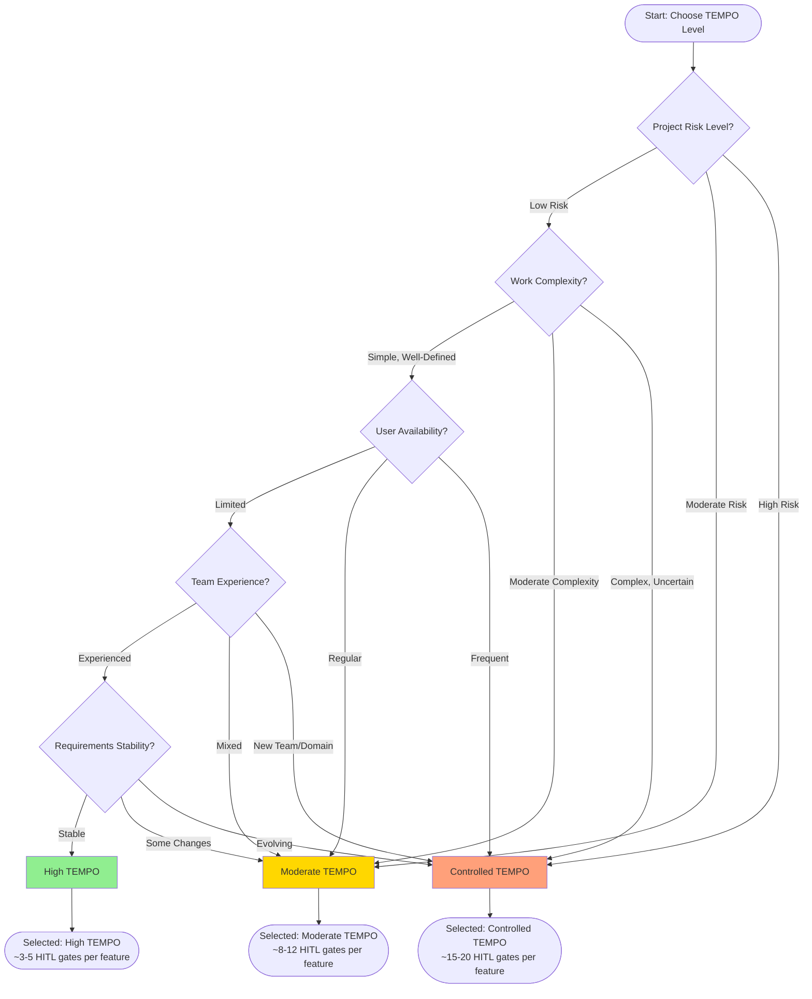
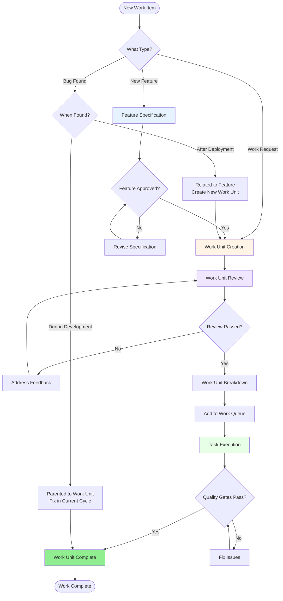

# RHYTHM Method Quick Reference

**Version:** 1.0.0  
**Last Updated:** 2025-11-26  
**Status:** Quick Reference Guide

This quick reference provides essential formulas, decision trees, and key information for using RHYTHM Method.

## Token Estimation Formula Reference

### Basic Token Count Formula

```
Total Tokens = Code Tokens + Analysis Tokens + Documentation Tokens + Validation Tokens
```

### Code Token Calculation

```
Code Tokens = Base LOC Tokens × Complexity Multiplier × Pattern Multiplier × Integration Multiplier
```

**Base LOC to Tokens:**
- Standard: 1 line of code ≈ 2-4 tokens (average 3 tokens/LOC)

**Complexity Multipliers:**
- Simple: 1.0x (straightforward logic, minimal branching)
- Moderate: 1.5x (some conditionals, loops, error handling)
- Complex: 2.5x (nested logic, multiple patterns, complex algorithms)

**Pattern Multipliers:**
- Simple pattern: 1.0x (single responsibility, clear structure)
- Moderate pattern: 1.3x (multiple responsibilities, some abstraction)
- Complex pattern: 1.8x (multiple abstractions, design patterns, frameworks)

**Integration Multipliers:**
- No integration: 1.0x (standalone code)
- Simple integration: 1.2x (single API/service integration)
- Complex integration: 1.5x (multiple services, async, complex error handling)

### Roll-Up Estimation

**Work Unit Tokens:**
```
Work Unit Tokens = Sum of all Agent Task Tokens + Work Unit Overhead (6%)
```

**Feature Tokens:**
```
Feature Tokens = Sum of all Work Unit Tokens + Feature Overhead (12%)
```

**Project Manifest Tokens:**
```
Project Manifest Tokens = Sum of all Feature Tokens + Project Overhead (17%)
```

### Overhead Percentages

- **Work Unit Overhead:** 5-8% (Default: 6%)
- **Feature Overhead:** 10-15% (Default: 12%)
- **Project Overhead:** 15-20% (Default: 17%)

### Token Throughput Rates (Baseline)

**General Purpose Agents:**
- Basic agent: 150-200 tokens/hour
- Standard agent: 200-250 tokens/hour
- Advanced agent: 250-350 tokens/hour

**Specialized Agents:**
- Research/analysis agent: 180-220 tokens/hour
- Code generation agent: 250-350 tokens/hour
- Documentation agent: 200-280 tokens/hour
- Testing/validation agent: 180-240 tokens/hour

**Adjustment Factors:**
- Simple tasks: +20% throughput
- Complex tasks: -30% throughput
- Domain expertise match: +15% throughput
- New domain: -20% throughput
- Tool support available: +10% throughput

---

## TEMPO Selection Decision Tree



### TEMPO Level Summary

| TEMPO Level | HITL Gates | Use Case | User Involvement |
|------------|------------|----------|------------------|
| **High** | ~3-5 gates | Well-defined, low-risk work | Minimal |
| **Moderate** | ~8-12 gates | Standard projects, some complexity | Regular |
| **Controlled** | ~15-20 gates | Critical, high-risk work | Frequent |

**Default Recommendation:** Start with **Moderate TEMPO** unless you have specific reasons to change.

---

## Workflow Decision Flowchart



---

## WBS Hierarchy Quick Reference

```
Project Manifest (One per project)
  └── Feature (Deliverable functionality)
      └── Work Unit (Single execution cycle, up to 8 hours)
          └── Agent Task (Smallest executable unit, 30min-2hrs)
```

### Bug Relationships

- **Parented to Work Unit:** Bugs found during development → Fix in current cycle
- **Related to Feature:** Bugs found in production → Requires new Work Unit

---

## Dependency-Driven Prioritization Rules

1. **Dependencies First:** Work ordered by dependency graph levels
2. **Business Value Second:** Within same dependency level, prioritize by business value
3. **Mandatory Rule:** Dependencies must be resolved before dependent work begins

### Dependency Types

- **Technical:** Code, APIs, infrastructure
- **Data:** Database schemas, data models
- **Integration:** External services, third-party APIs
- **Knowledge:** Domain understanding, architectural decisions

---

## Execution Cycle Duration Guidelines

- **Target:** Up to 8 hours per execution cycle
- **Typical:** 2-6 hours for most Work Units
- **Best Case:** < 2 hours for simple, well-defined Work Units
- **Longer Cycles:** 6-8 hours for complex Work Units (with approval)

**If estimation exceeds 8 hours:**
1. **Preferred:** Split Work Unit into smaller units
2. **Alternative:** Extend execution cycle (requires approval)
3. **Alternative:** Reduce scope to fit within 8 hours

---

## HITL Gate Response Times

- **Immediate Response (Emergency):** < 15 minutes
- **High Priority Response:** < 2 hours
- **Normal Priority Response:** < 8 hours (within business day)
- **Low Priority Response:** < 24 hours

---

## Key Terminology

- **User:** Human stakeholder (not "customer" or "stakeholder")
- **Agent Task:** Smallest unit of executable work (not "Task")
- **Work Unit:** Specific piece of work in execution cycle (not "Unit of Work")
- **Execution Cycle:** Focused work period up to 8 hours (not "Cycle")
- **Project Manifest:** Single top-level container (replaces Epics)

---

## Quick Links

- [Getting Started](02-getting-started.md) - How to adopt RHYTHM Method
- [Dictionary](03-dictionary.md) - Complete terminology
- [TEMPO](05-tempo.md) - Detailed TEMPO documentation
- [Estimation](08-estimation.md) - Complete token estimation guide
- [Workflows](06-workflows.md) - Detailed workflow processes
- [Best Practices](10-best-practices.md) - Implementation guidance

---

## Navigation

**Previous:** [Error Handling](13-error-handling.md) - Error handling and failure recovery  
**Next:** [Workflow Example](14-workflow-example.md) - End-to-end workflow example

---

## Change History

| Version | Date       | Author              | Description                    |
| ------- | ---------- | ------------------- | ------------------------------ |
| 1.0.0   | 2025-11-26 | technical-writer-agent | Initial quick reference guide |

